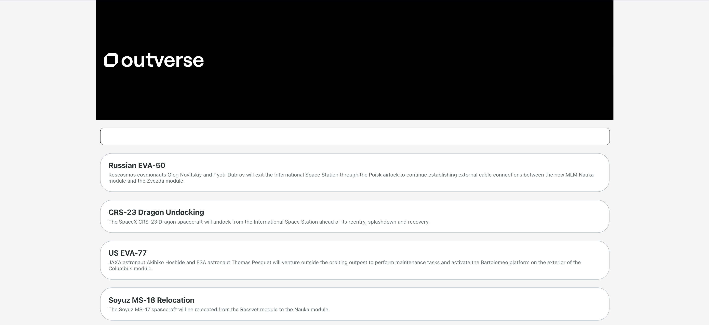

## OUTVERSE_FRONTEND

*TODO: provide a UI to search for and display upcoming spaceflight events*

[David Lazar](mailto:me@davidlazar.co)

## Proposed Solution

*TODO:*
- Used create-react-app to create the project
- Using the bare bone method done the basic structure of the project and flow of the data
- Created base components to be used
- Created the types Utils based on the api responses
- Created the missions API client file in order to keep our API calls separate for cleaner components
- Used 2 different 'views' components one for the main page and one for the single event view
- Basic styling of the components using styled-components

## Screenshots

## Libraries / Tools Used

- React.js
- Create React App for project setup
- Usehooks
- Styled-components
- Jest

## Setup

To install the dependencies run:

`npm install`

And to run the app:

`npm start`
Runs the app in the development mode.
Open http://localhost:3000 to view it in the browser.

The page will reload if you make edits.

## Running the tests

You can run the unit tests using:

`npm test`

## Future Work

1. Complete test coverage to achieve 90%
2. Improve styling and responsive design
3. Test for perfomance and consider setting up a CDN
